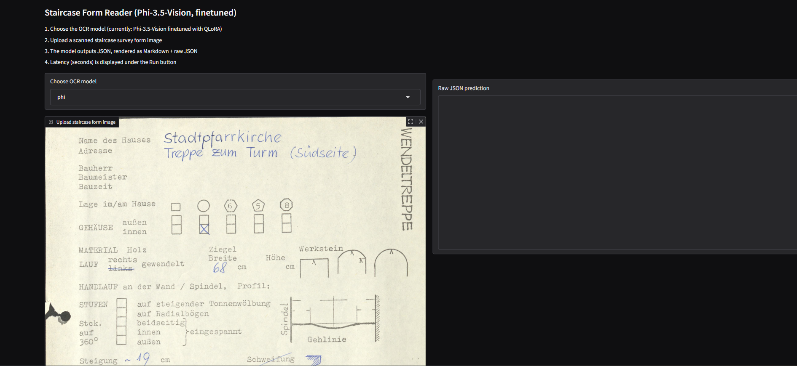
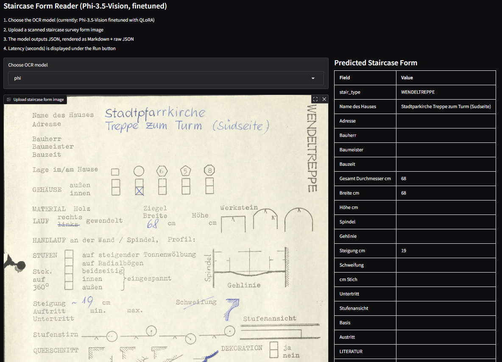

<p align="center">
  <h1 align="center">Comparative Analysis of Vision Language Models<br>for Structured OCR on Historical Documents</h1>
</p>

<p align="center">
  <a href="https://www.python.org/downloads/release/python-3110/"></a>
  <a href="https://pytorch.org/"></a>
  <a href="https://huggingface.co/docs/transformers"></a>
  <a href="https://github.com/unslothai/unsloth"></a>
  <a href="https://optuna.org/"></a>
  <a href="https://www.fau.eu/"></a>
</p>

<p align="center">
  A systematic benchmarking framework comparing <strong>eight Vision Language Models (VLMs)</strong> on their ability to extract structured JSON output from scanned historical German documents. Experiments span zero-shot, few-shot, fine-tuning, hyperparameter optimization, multi-stage training, multi-dataset training, and image preprocessing studies — all evaluated with CER, ANLS*, and mAP-F1 metrics.
</p>

---

## 📑 Table of Contents

- [Introduction](#-introduction)
- [Models](#-models)
- [Datasets](#-datasets)
- [Experiment Pipeline](#-experiment-pipeline)
- [Project Structure](#-project-structure)
- [Setup](#-setup)
- [Data Label Creation](#-data-label-creation)
- [Running Experiments](#-running-experiments)
- [Evaluation Metrics](#-evaluation-metrics)
- [Interactive UI](#-interactive-ui)
- [HPC Job Scheduling](#-hpc-job-scheduling)
- [Built With](#-built-with)

---

## 📌 Introduction

This project is a **Master's thesis** conducted at [Friedrich-Alexander-Universität Erlangen-Nürnberg (FAU)](https://www.fau.eu/) investigating how well modern Vision Language Models can perform **OCR on historical German documents** and return the extracted information as **structured JSON**.

Three document collections are used:

| Dataset | Description | Language |
|---|---|---|
| **Inventory** | Historical museum inventory book entries | German (printed + handwritten) |
| **Schmuck** | Jewellery catalogue cards | German (printed + handwritten) |
| **Staircase** | Architectural staircase survey forms | German (printed + handwritten, checkboxes) |

Each model is prompted (or fine-tuned) to read a scanned document image and produce a single JSON object whose keys and nesting match a predefined schema — no free-form text, no markdown, just valid JSON.

---

## 🤖 Models

Eight VLMs are benchmarked across multiple experimental settings:

| # | Model | Type | Quantization | Training Framework |
|---|---|---|---|---|
| 1 | **Donut** (`naver-clova-ix/donut-base`) | Encoder–Decoder | Full precision | HuggingFace Transformers |
| 2 | **Florence-2** (`microsoft/Florence-2-large`) | Encoder–Decoder | Full precision | HuggingFace Transformers |
| 3 | **PaddleOCR-VL** (`PaddlePaddle/PaddleOCR-VL`) | Decoder-only | bfloat16 | HuggingFace Transformers |
| 4 | **Gemma-3-4B-IT** (`google/gemma-3-4b-it`) | Decoder-only | 4-bit QLoRA (Unsloth) | Unsloth + TRL SFTTrainer |
| 5 | **Nanonets-OCR-s** | Decoder-only | 4-bit QLoRA (Unsloth) | Unsloth + TRL SFTTrainer |
| 6 | **Phi-3.5-Vision** (`microsoft/Phi-3.5-vision-instruct`) | Decoder-only | 4-bit QLoRA (BitsAndBytes) | HuggingFace Trainer + PEFT |
| 7 | **Qwen2.5-VL-7B** (`Qwen/Qwen2.5-VL-7B-Instruct`) | Decoder-only | 4-bit QLoRA (Unsloth) | Unsloth + TRL SFTTrainer |
| 8 | **Nanonets** (few-shot capable) | Decoder-only | 4-bit QLoRA (Unsloth) | Unsloth + TRL SFTTrainer |

---

## 📊 Datasets

All datasets follow the same format:

- **Images**: Scanned document pages (`.jpg` / `.png`)
- **Labels**: JSONL files (`train.jsonl`, `val.jsonl`, `test.jsonl`) where each line is a JSON object containing an `image_name` field and the structured ground-truth fields.

Example ground-truth (Inventory dataset):

```json
{
  "image_name": "inventarbuch-042.jpg",
  "Überschrift": "Inventar des Museums",
  "Inventarnummer": "J= 1234",
  "Maße": { "L": "12 cm", "B": "8 cm", "D": "3 cm" },
  "Objektbezeichnung": "Bronzefibel",
  "Fundort": "Erlangen, Burgberg",
  "Fundzeit": "1923",
  "Beschreibungstext": "Gut erhaltene Fibel mit Spiralkonstruktion..."
}
```

---

## 🔬 Experiment Pipeline

Each model is evaluated through a progressive pipeline of experiments:

```
Zero-Shot ──► Few-Shot ──► Fine-Tuning (base hyperparams)
                                │
                                ├──► HPO (Optuna) ──► Fine-Tuning w/ Best HPs
                                │
                                ├──► Image Preprocessing Study   (uses base hyperparams)
                                ├──► Multi-Stage Training        (uses base hyperparams)
                                └──► Multi-Dataset Training      (uses base hyperparams)
```

All secondary studies (HPO, Image Preprocessing, Multi-Stage, and Multi-Dataset) are conducted **on top of the base fine-tuning code** using the initial (non-optimized) hyperparameters. Only the "Fine-Tuning w/ Best HPs" branch uses the optimized hyperparameters discovered by Optuna.

| Experiment | Description |
|---|---|
| **Zero-Shot** | Inference with no training; the model is prompted with the JSON schema and asked to extract fields from a document image. |
| **Few-Shot** | One or more labelled examples are included in the prompt as demonstrations before asking the model to process a new image. |
| **Fine-Tuning** | The model is fine-tuned on the training split using QLoRA (4-bit) or full-parameter training, with CER-based best-model selection on the validation set. All subsequent experiments branch from this baseline. |
| **HPO (Optuna)** | A secondary study on top of base fine-tuning. Uses Optuna with an SQLite backend to tune learning rate, LoRA rank/alpha/dropout, weight decay, gradient accumulation, and epochs. The scripts in the `hpo/` folder **only search for the best hyperparameters** — they do not produce a final trained model. The discovered parameters are exported to a JSON file. |
| **Fine-Tuning with Best HPs** | Re-runs the base fine-tuning code using the optimized hyperparameters found by Optuna. The `*_finetune_hpo.py` files in the `finetune/` folder are identical to the base fine-tuning scripts but with the Optuna-discovered hyperparameters plugged in. This is the **only** experiment that uses non-default hyperparameters. |
| **Image Preprocessing** | A secondary study on top of base fine-tuning (using base hyperparams). Applies four image preprocessing steps (brightness, contrast, sharpness, rotation) during training to determine whether augmentation benefits VLMs. |
| **Multi-Stage Training** | A secondary study on top of base fine-tuning (using base hyperparams). Two-stage training: Stage 1 (warm-up) uses teacher forcing only with higher LR; Stage 2 uses evaluation-based best-model selection with generation CER. |
| **Multi-Dataset Training** | A secondary study on top of base fine-tuning (using base hyperparams). A single model and LoRA adapter is trained on the combined training data of all three datasets, then evaluated per-dataset. |

---

## 📁 Project Structure

```
Uddipan-Thesis/
│
├── data_labels_creation/               <- Ground-truth label generation
│   ├── labelling_code1.py              <- Llama-4-Maverick via Groq API (few-shot labelling)
│   ├── labelling_code2_tesseract.py    <- Llama-4-Maverick + Tesseract OCR pre-pass
│   └── inventory.py                    <- Gemini-3-Flash for inventory label extraction
│
├── DONUT/                              <- Donut (naver-clova-ix/donut-base)
│   ├── finetune/                       <- Full fine-tuning scripts
│   │   ├── inven_new_base.py           <- Inventory dataset fine-tuning
│   │   ├── inven_new_cord.py           <- Inventory dataset finetune (using donut cord)
│   │   ├── schmuck_base.py             <- Schmuck dataset fine-tuning
│   │   ├── schmuck_cord.py             <- Schmuck dataset finetune(using donut cord)
│   │   └── stair_base_cord.py          <- Staircase dataset (donut Base +  donut cord)
│   └── zero_shot/                      <- Zero-shot inference scripts
│       ├── zero_inven_new.py           <- Inventory zero-shot
│       ├── zero_inven_cord.py          <- Inventory (CORD) zero-shot
│       ├── zero_schmuck_base.py        <- Schmuck zero-shot
│       ├── zero_schmuck_cord.py        <- Schmuck (CORD) zero-shot
│       ├── zero_stair_base.py          <- Staircase zero-shot
│       └── zero_stair_cord.py          <- Staircase (CORD) zero-shot
│
├── florence2/                          <- Florence-2 (microsoft/Florence-2-large)
│   ├── finetune/                       <- Full-parameter fine-tuning scripts
│   │   ├── inventory_finetune.py       <- Inventory dataset
│   │   ├── schmuck_finetune.py         <- Schmuck dataset
│   │   ├── stair_finetune.py           <- Staircase dataset
│   │   └── stair_finetune2.py          <- Staircase (variant)
│   └── zero_shots/                     <- Zero-shot inference scripts
│       ├── zero_shot_inventory.py      <- Inventory zero-shot
│       ├── zero_schmuck.py             <- Schmuck zero-shot
│       └── zero_stair.py              <- Staircase zero-shot
│
├── paddleocr/                          <- PaddleOCR-VL
│   ├── finetune_code/                  <- Fine-tuning scripts
│   │   ├── inventory_finetune.py       <- Inventory dataset
│   │   ├── schmuck_finetune.py         <- Schmuck dataset
│   │   └── stair_finetune.py           <- Staircase dataset
│   └── zero_shot_code/                 <- Zero-shot inference scripts
│       ├── inven_new_inference.py      <- Inventory inference
│       ├── schmuck_inference.py        <- Schmuck inference
│       └── stair_inference.py          <- Staircase inference
│
├── gemma3/                             <- Gemma-3-4B-IT (google/gemma-3-4b-it)
│   ├── finetune/                       <- Fine-tuning (base + HPO-optimized)
│   │   ├── inventory_finetune.py       <- Inventory (base hyperparams)
│   │   ├── inventory_finetune_hpo.py   <- Inventory (Optuna-optimized HPs)
│   │   ├── schmuck_finetune.py         <- Schmuck (base hyperparams)
│   │   ├── schmuck_finetune_hpo.py     <- Schmuck (Optuna-optimized HPs)
│   │   ├── stair_finetune.py           <- Staircase (base hyperparams)
│   │   └── stair_finetune_hpo.py       <- Staircase (Optuna-optimized HPs)
│   ├── hpo/                            <- Optuna HPO (outputs best HPs only, no final model)
│   │   ├── inventory_hpo.py            <- HPO for inventory dataset
│   │   ├── schmuck_hpo.py              <- HPO for schmuck dataset
│   │   └── stair_hpo.py                <- HPO for staircase dataset
│   ├── image_preprocess/               <- Image preprocessing study
│   │   ├── inventory_preprocess.py     <- Inventory + augmentation pipeline
│   │   ├── schmuck_preprocess.py       <- Schmuck + augmentation pipeline
│   │   └── stair_preprocess.py         <- Staircase + augmentation pipeline
│   ├── multistage_and_multidataset/    <- Advanced training strategies
│   │   ├── inventory_multistage.py     <- Multi-stage training (inventory)
│   │   ├── schmuck_multistage.py       <- Multi-stage training (schmuck)
│   │   ├── stair_multistage.py         <- Multi-stage training (staircase)
│   │   └── multidataset_finetune.py    <- Combined multi-dataset training
│   └── zero_few_shots/                 <- Zero-shot & few-shot inference
│       ├── zero_shot_inventory.py      <- Inventory zero-shot
│       ├── zero_shot_stair.py          <- Staircase zero-shot
│       ├── zero_schmuck.py             <- Schmuck zero-shot
│       ├── few_shot_inventory.py       <- Inventory few-shot
│       ├── few_shot_schmuck.py         <- Schmuck few-shot
│       └── few_shots_stair.py          <- Staircase few-shot
│
├── nanonets/                           <- Nanonets-OCR-s
│   ├── finetune/                       <- Fine-tuning scripts
│   │   ├── inventory_finetune.py       <- Inventory dataset
│   │   ├── schmuck_finetune.py         <- Schmuck dataset
│   │   └── stair_finetune.py           <- Staircase dataset
│   └── zero_few_shots/                 <- Zero-shot & few-shot inference
│       ├── zero_inven.py               <- Inventory zero-shot
│       ├── zero_schmuck.py             <- Schmuck zero-shot
│       ├── zero_stair.py               <- Staircase zero-shot
│       ├── few_inven.py                <- Inventory few-shot
│       ├── few_schmuck.py              <- Schmuck few-shot
│       └── few_stair.py                <- Staircase few-shot
│
├── phivision/                          <- Phi-3.5-Vision (microsoft/Phi-3.5-vision-instruct)
│   ├── finetune/                       <- Fine-tuning (base + HPO-optimized)
│   │   ├── inventory_finetune.py       <- Inventory (base hyperparams)
│   │   ├── inventory_finetune_hpo.py   <- Inventory (Optuna-optimized HPs)
│   │   ├── schmuck_finetune.py         <- Schmuck (base hyperparams)
│   │   ├── schmuck_finetune_hpo.py     <- Schmuck (Optuna-optimized HPs)
│   │   ├── stair_finetune.py           <- Staircase (base hyperparams)
│   │   └── stair_finetune_hpo.py       <- Staircase (Optuna-optimized HPs)
│   ├── hpo/                            <- Optuna HPO (outputs best HPs only, no final model)
│   │   ├── inventory_hpo.py            <- HPO for inventory dataset
│   │   ├── schmuck_hpo.py              <- HPO for schmuck dataset
│   │   └── stair_with_hpo.py           <- HPO for staircase dataset
│   ├── image_preprocess/               <- Image preprocessing study
│   │   ├── inventory_preprocess.py     <- Inventory + augmentation pipeline
│   │   ├── schmuck_preprocess.py       <- Schmuck + augmentation pipeline
│   │   └── stair_preprocess.py         <- Staircase + augmentation pipeline
│   ├── multistage_and_multidataset/    <- Advanced training strategies
│   │   ├── inventory_multistage.py     <- Multi-stage training (inventory)
│   │   ├── schmuck_multistage.py       <- Multi-stage training (schmuck)
│   │   ├── stair_multistage.py         <- Multi-stage training (staircase)
│   │   └── multidataset_finetune.py    <- Combined multi-dataset training
│   └── shots/                          <- Zero-shot & few-shot inference
│       ├── zero_inventory.py           <- Inventory zero-shot
│       ├── zero_schmuck.py             <- Schmuck zero-shot
│       ├── zero_stair.py               <- Staircase zero-shot
│       ├── few_inventory.py            <- Inventory few-shot
│       ├── few_schmuck.py              <- Schmuck few-shot
│       └── few_stair.py                <- Staircase few-shot
│
├── qwen/                              <- Qwen2.5-VL-7B (Qwen/Qwen2.5-VL-7B-Instruct)
│   ├── finetune/                       <- Fine-tuning (base + HPO-optimized)
│   │   ├── inventory_finetune.py       <- Inventory (base hyperparams)
│   │   ├── inventory_finetune_hpo.py   <- Inventory (Optuna-optimized HPs)
│   │   ├── schmuck_finetune.py         <- Schmuck (base hyperparams)
│   │   ├── schmuck_finetune_hpo.py     <- Schmuck (Optuna-optimized HPs)
│   │   ├── staircase_finetune.py       <- Staircase (base hyperparams)
│   │   └── stair_finetune_hpo.py       <- Staircase (Optuna-optimized HPs)
│   ├── hpo/                            <- Optuna HPO (outputs best HPs only, no final model)
│   │   ├── inventory_hpo.py            <- HPO for inventory dataset
│   │   ├── schmuck_hpo.py              <- HPO for schmuck dataset
│   │   └── stair_hpo.py                <- HPO for staircase dataset
│   ├── image_preprocess/               <- Image preprocessing study
│   │   ├── inventory_preprocess.py     <- Inventory + augmentation pipeline
│   │   ├── schmuck_preprocess.py       <- Schmuck + augmentation pipeline
│   │   └── stair_preprocess.py         <- Staircase + augmentation pipeline
│   ├── multistage_and_multidataset/    <- Advanced training strategies
│   │   ├── inventory_multistage.py     <- Multi-stage training (inventory)
│   │   ├── schmuck_multistage.py       <- Multi-stage training (schmuck)
│   │   ├── stair_multistage.py         <- Multi-stage training (staircase)
│   │   └── multidataset_finetune.py    <- Combined multi-dataset training
│   └── zero_and_few_shot/              <- Zero-shot & few-shot inference
│       ├── zero_shot_inventory.py      <- Inventory zero-shot
│       ├── zeroshot_stair.py           <- Staircase zero-shot
│       ├── zero_schmuck.py             <- Schmuck zero-shot
│       ├── few_shots_inventory.py      <- Inventory few-shot
│       ├── fewshots_schmuck.py         <- Schmuck few-shot
│       └── staircase_few_shot.py       <- Staircase few-shot
│
├── map_f1_and_anls/                    <- Evaluation metric scripts
│   ├── anls_all.py                     <- ANLS* metric computation (anls_star library)
│   └── map_f1_all.py                   <- mAP-style Precision/Recall/F1 via per-field CER
│
├── UI_codes/                           <- Interactive Gradio + FastAPI demo application
│   ├── phi_ui.py                       <- OCR inference UI (model selection, JSON + Markdown output)
│   ├── image1.png                      <- UI screenshot 1
│   └── image2.png                      <- UI screenshot 2
│
├── jobfiles/                           <- SLURM job scripts for FAU HPC cluster
│   ├── job_gemma.sh, job_phi.sh, ...   <- Training/inference job submissions
│   ├── GOT/                            <- GOT-OCR related job files
│   ├── no_post_process/                <- Jobs without post-processing
│   ├── post_process/                   <- Jobs with post-processing
│   └── utils/                          <- Utility job scripts (JSON conversion, UI, saliency)
│
├── logs/                               <- SLURM output logs (stdout/stderr per job ID)
│   ├── DONUT/                          <- Donut experiment logs
│   ├── Florence2/                      <- Florence-2 experiment logs
│   ├── gemma/                          <- Gemma-3 experiment logs
│   ├── nano/                           <- Nanonets experiment logs
│   ├── NANONETS/                       <- Nanonets (additional) logs
│   ├── paddle/                         <- PaddleOCR-VL experiment logs
│   ├── phi/                            <- Phi-3.5-Vision experiment logs
│   ├── QWEN/                           <- Qwen2.5-VL experiment logs
│   ├── UI/                             <- UI-related logs
│   └── utils/                          <- Utility script logs
│
├── optuna db/                          <- Optuna study database
│   └── vlmmodels.db                    <- SQLite DB for all HPO trials
│
├── yml_env_files/                      <- Conda environment files
│   ├── gemma_vision.yml                <- Gemma-3 environment
│   ├── phi_ocr.yml                     <- Phi-3.5-Vision environment
│   ├── qwen_vision.yml                 <- Qwen2.5-VL environment
│   ├── florence2_env.yml               <- Florence-2 environment
│   ├── donut118.yml                    <- Donut environment
│   ├── paddleocr.yml                   <- PaddleOCR-VL environment
│   ├── nanonets.yml                    <- Nanonets environment
│   ├── got_ocr.yml                     <- GOT-OCR environment
│   ├── uddipan_thesis.yml              <- General thesis environment
│   └── ...                             <- Additional environment files
│
└── README.md                           <- This file
```

---

## 🚀 Setup

### Prerequisites

- Python 3.11+
- CUDA-enabled GPU (NVIDIA A100 / V100 recommended)
- Conda (Miniconda or Anaconda)

### Environment Installation

Each model has its own Conda environment file in `yml_env_files/`. Create the environment for the model you want to run:

```bash
# Example: Gemma-3
conda env create -f yml_env_files/gemma_vision.yml
conda activate gemma_vision

# Example: Phi-3.5-Vision
conda env create -f yml_env_files/phi_ocr.yml
conda activate phi_ocr

# Example: Qwen2.5-VL
conda env create -f yml_env_files/qwen_vision.yml
conda activate qwen_vision

# Example: Donut
conda env create -f yml_env_files/donut118.yml
conda activate donut118

# Example: Florence-2
conda env create -f yml_env_files/florence2_env.yml
conda activate florence2_env

# Example: PaddleOCR-VL
conda env create -f yml_env_files/paddleocr.yml
conda activate paddleocr

# Example: Nanonets
conda env create -f yml_env_files/nanonets.yml
conda activate nanonets
```

### Data Preparation

Organize your data in the following format:

```
your_data_dir/
├── train.jsonl       <- Training split (one JSON object per line)
├── val.jsonl         <- Validation split
├── test.jsonl        <- Test split
└── images/           <- Document images referenced by image_name in JSONL
    ├── doc-001.jpg
    ├── doc-002.jpg
    └── ...
```

---

## 🏷️ Data Label Creation

Ground-truth labels were generated semi-automatically using two LLM-based pipelines:

| Script | Model | Method |
|---|---|---|
| `labelling_code1.py` | **Llama-4-Maverick-17B** (via Groq API) | Few-shot prompting with example images encoded as base64 |
| `labelling_code2_tesseract.py` | **Llama-4-Maverick-17B** + **Tesseract OCR** | Two-pass: Tesseract extracts raw text first, then Llama structures it into JSON |
| `inventory.py` | **Gemini-3-Flash** (Google GenAI API) | Direct image-to-JSON extraction with structured prompt |

All labels were manually reviewed and corrected after automatic generation.

---

## ▶️ Running Experiments

### Zero-Shot / Few-Shot Inference

```bash
# Activate the appropriate environment
conda activate gemma_vision

# Run zero-shot inference
python gemma3/zero_few_shots/zero_shot_inventory.py

# Run few-shot inference
python gemma3/zero_few_shots/few_shot_inventory.py
```

### Fine-Tuning

```bash
# Base fine-tuning
python gemma3/finetune/inventory_finetune.py

# Fine-tuning with Optuna-optimized hyperparameters
python gemma3/finetune/inventory_finetune_hpo.py
```

### Hyperparameter Optimization (Optuna)

```bash
# Run HPO — results are saved to optuna db/vlmmodels.db
python gemma3/hpo/inventory_hpo.py
```

The HPO script uses Optuna with an SQLite backend (`vlmmodels.db`) to tune:
- Learning rate, weight decay, max gradient norm
- LoRA rank (`r`), alpha
- Gradient accumulation steps
- Warmup ratio

Best hyperparameters are exported to a JSON file in the run output directory.

### Image Preprocessing Study

```bash
python gemma3/image_preprocess/inventory_preprocess.py
```

Applies four preprocessing during training to check if VLM benefits:
- Illumination flattening (grayscale)
- Gentle denoising
- CLAHE on luminance
- Letterbox resize to 1024×1024

### Multi-Stage Training

```bash
python gemma3/multistage_and_multidataset/inventory_multistage.py
```

Two-stage training:
1. **Stage 1 (Warm-up)**: Teacher forcing only, higher learning rate, no evaluation checkpoints
2. **Stage 2 (Main)**: Evaluation each epoch with autoregressive generation CER, best model saved

### Multi-Dataset Training

```bash
python gemma3/multistage_and_multidataset/multidataset_finetune.py
```

Trains a **single shared model + LoRA adapter** on the combined training data of all three datasets (Inventory + Schmuck + Staircase), then evaluates each dataset independently.

---

## 📏 Evaluation Metrics

All models are evaluated using three complementary metrics:

| Metric | Script | Description |
|---|---|---|
| **CER** (Character Error Rate) | Built into each training script | Primary metric for best-model selection during training. Computed via autoregressive generation on validation subset using `jiwer` and `editdistance`. |
| **ANLS\*** | `map_f1_and_anls/anls_all.py` | Universal document processing metric from [Peer et al., 2024](https://arxiv.org/abs/2402.03848). Compares predicted vs. ground-truth JSON dicts field-by-field using the `anls_star` library. |
| **mAP-F1** | `map_f1_and_anls/map_f1_all.py` | mAP-style Precision / Recall / F1 using per-field CER overlap at multiple thresholds (0.8, 0.7, 0.5, 0.3). Penalizes models that fail to produce valid JSON. |

### Running Evaluation

```bash
# Edit INPUT_JSONL_PATH and OUTPUT_PATH in the script, then:
python map_f1_and_anls/anls_all.py
python map_f1_and_anls/map_f1_all.py
```

Both scripts accept any prediction JSONL file (with universal key detection) and produce a detailed metrics JSON report.

---

## 🖥️ Interactive UI

A **Gradio + FastAPI** web application is provided for interactive OCR inference:

<p align="center">
  
</p>

<p align="center">
  
</p>

### Features

- **Model Selection**: Dropdown to choose between available fine-tuned models
- **Dual Output**: Results displayed as both raw JSON and a formatted Markdown table
- **Latency Tracking**: Inference time measured and displayed per request
- **In-Memory Caching**: Repeated images return cached results instantly
- **REST API**: FastAPI endpoints alongside the Gradio UI for programmatic access

### Running the UI

```bash
conda activate phi_ocr
python UI_codes/phi_ui.py

# Or via uvicorn:
uvicorn UI_codes.phi_ui:app --host 0.0.0.0 --port 8000
```

Access the UI at: `http://localhost:8000/ui`

---

## 🖧 HPC Job Scheduling

All experiments were run on the **FAU HPC cluster** using SLURM. Job scripts are in `jobfiles/`:

```bash
# Submit a training job
sbatch jobfiles/job_gemma.sh

# Submit an inference job
sbatch jobfiles/job_gemma_stair.sh
```

Each `.sh` file specifies:
- GPU resources (A100 / A40)
- Conda environment activation
- Python script execution with appropriate paths
- Output log redirection to `logs/`

---

## 🧰 Built With

- [PyTorch](https://pytorch.org/) — Deep learning framework
- [HuggingFace Transformers](https://huggingface.co/docs/transformers) — Model loading, tokenization, and training
- [Unsloth](https://github.com/unslothai/unsloth) — Memory-efficient 4-bit QLoRA fine-tuning for Gemma, Qwen, and Nanonets
- [PEFT](https://github.com/huggingface/peft) — Parameter-Efficient Fine-Tuning (LoRA adapters for Phi-3.5-Vision)
- [BitsAndBytes](https://github.com/TimDettmers/bitsandbytes) — 4-bit quantization
- [TRL](https://github.com/huggingface/trl) — SFTTrainer for supervised fine-tuning
- [Optuna](https://optuna.org/) — Hyperparameter optimization with SQLite storage
- [Gradio](https://gradio.app/) — Interactive web UI
- [FastAPI](https://fastapi.tiangolo.com/) — REST API backend for the UI
- [jiwer](https://github.com/jitsi/jiwer) — CER computation
- [anls_star](https://github.com/deepopinion/anls_star_metric) — ANLS* metric
- [Tesseract OCR](https://github.com/tesseract-ocr/tesseract) — OCR pre-pass for label generation
- [Google GenAI](https://ai.google.dev/) — Gemini API for label generation
- [Groq](https://groq.com/) — Llama-4-Maverick API for label generation
- [FAU HPC](https://hpc.fau.de/) — High-performance computing cluster at FAU Erlangen-Nürnberg

---

## 👤 Author

**Uddipan Basu Bir**

- Email: [uddipan.bir.basu@fau.de](mailto:uddipan.bir.basu@fau.de) · [uddipanbb95@gmail.com](mailto:uddipanbb95@gmail.com)
- GitHub: [@uddipan77](https://github.com/uddipan77)

---

## ⚠️ Model Weights & Fine-tuned Checkpoints

This repository contains **only the source code, scripts, and configuration files**. The fine-tuned model weights, LoRA adapters, and trained checkpoints are **not included** due to their large size.

If you need access to the fine-tuned weights or trained model checkpoints, please contact:

> **Uddipan Basu Bir** — [uddipan.bir.basu@fau.de](mailto:uddipan.bir.basu@fau.de) / [uddipanbb95@gmail.com](mailto:uddipanbb95@gmail.com)

---

<p align="center">
  <sub>Friedrich-Alexander-Universität Erlangen-Nürnberg — Master's Thesis, 2026</sub>
</p>
